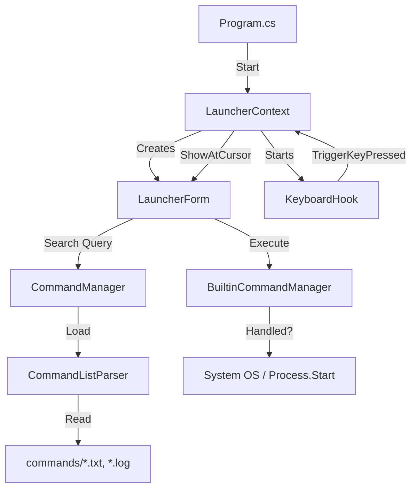

# プログラムの処理フロー概要

FuzzyLauncher（旧IncrementalLauncher）の起動からコマンド実行までの流れを、主要なコンポーネントの役割と共に解説します。

## 1. アプリケーションの起動 (Startup)

プログラムのエントリポイントは `Program.cs` です。

1. **二重起動の防止**: `Mutex` を使用して、アプリケーションが複数起動しないように制御します。
2. **Context の作成**: `Application.Run(new LauncherContext())` で、メインループを開始します。このアプリは「フォームを表示して待つ」のではなく、トレイアイコン（`NotifyIcon`）を主体とする `ApplicationContext` で動作します。
3. **キーボードフックの開始**: `LauncherContext` のコンストラクタで `KeyboardHook.Start()` を呼び出し、システム全体のキー入力を監視し始めます。
4. **設定とコマンドの読み込み**: `CommandManager` の静的コンストラクタが走り、`commands` フォルダ内のすべての `.txt` および `.log` ファイルと `settings.ini` がメモリに読み込まれます。

## 2. ランチャーの起動 (Activation)

ユーザーが特定のホットキー（変換キーやひらがなキーなど）を押した際のフローです。

1. **Hotkey 検知**: `KeyboardHook` が低レベルフックでキー入力をキャッチし、トリガーキーであれば `TriggerKeyPressed` イベントを発火します。
2. **UI 表示**: `LauncherContext` がイベントを受け取り、`LauncherForm.ShowAtCursor()` を呼び出します。
3. **入力キャプチャの有効化**: `KeyboardHook.IsActive = true` に設定されます。これにより、ランチャーが表示されている間、すべてのキー入力が `LauncherForm` に送られるようになります。

## 3. 入力と検索 (Input & Search)

ユーザーが文字を入力している間のフローです。

1. **キーイベントの処理**: `LauncherForm` の `OnGlobalKeyPress` で入力文字を受け取り、`_currentQuery` を更新します。
2. **検索の実行**: `CommandManager.Search(_currentQuery)` が呼び出されます。
   - `CommandManager` は現在の「グループ」に属するコマンドに対してスコアリングを行い、マッチ精度の高い順にソートして返します。
   - スコアリングでは、連続マッチや略語入力（先頭文字、大文字、区切り文字の後）にボーナスを与えます。
3. **UI の更新**: `LauncherForm.UpdateSearch()` が検索結果をリストビュー（`_resultList`）に表示し、ウィンドウのサイズや位置を動的に調整します。

## 4. コマンドの実行 (Execution)

ユーザーが `Enter` や `Tab` を押してコマンドを確定した際のフローです。

1. **実行命令**: `LauncherForm.ExecuteSelection()` が呼ばれます。
2. **コマンド解析**: コマンドライン（セミコロン `;` 区切り）が分割されます。
3. **内製コマンドの実行**: `BuiltinCommandManager` (`Invoke-BuiltinCommand`) に渡されます。
   - `&active_title` や `&cmdlist` などの内製コマンドであればここで処理されます。
4. **外部プログラムの実行**: 内製コマンドでなかった場合、`cmd /c start` を介して外部プログラムやファイルが起動されます。
5. **ランチャーの終了**: 実行が終わると、通常は `CloseLauncher()` によりウィンドウが閉じ、`KeyboardHook.IsActive = false` に戻ります。

---

## 主要なコンポーネントの関係図

### コマンドリストの整理
- `commands` フォルダ内の `.txt` を分割して管理できます。
- `default.txt` はメインの設定ファイルであり、存在しない場合は自動生成されます。
- `README.txt` などのドキュメントはコマンドとして誤認識されるため、コメント行として `default.txt` 内に記述してください。
