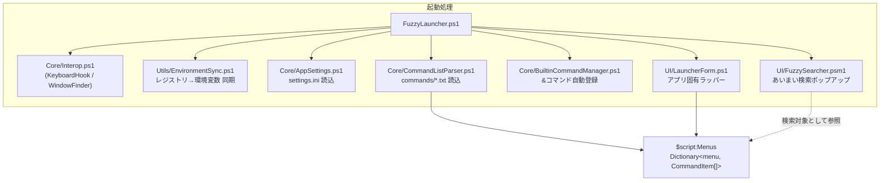
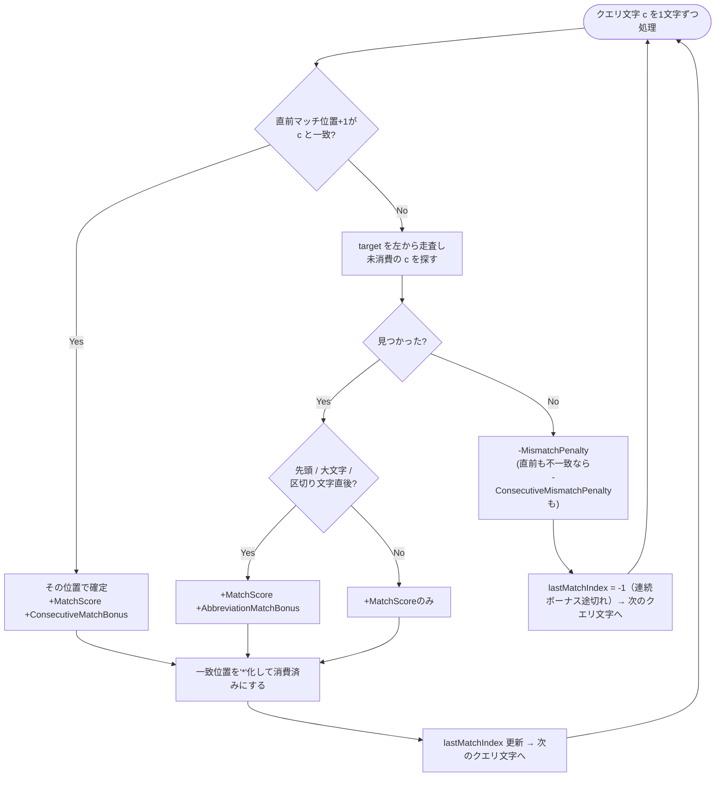
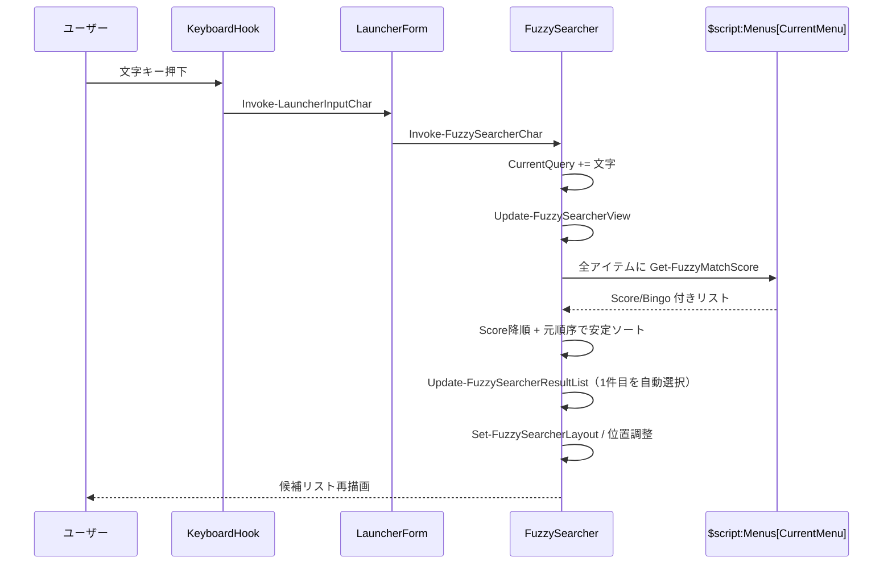
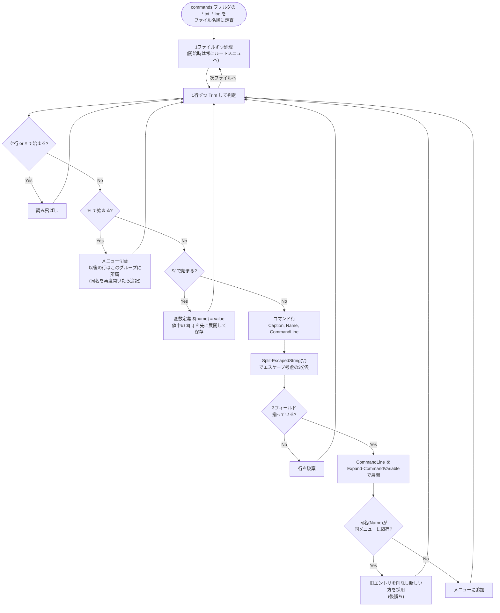
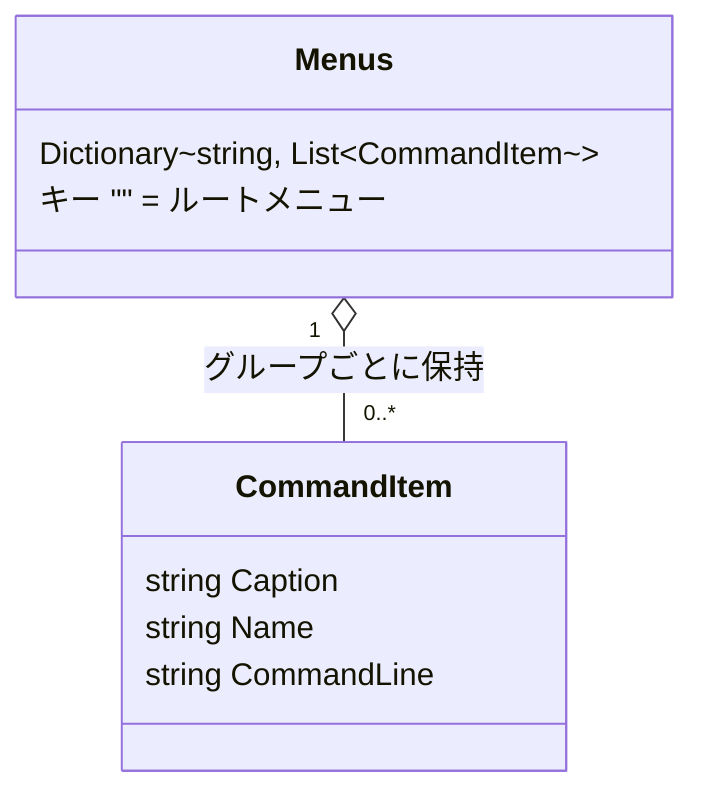
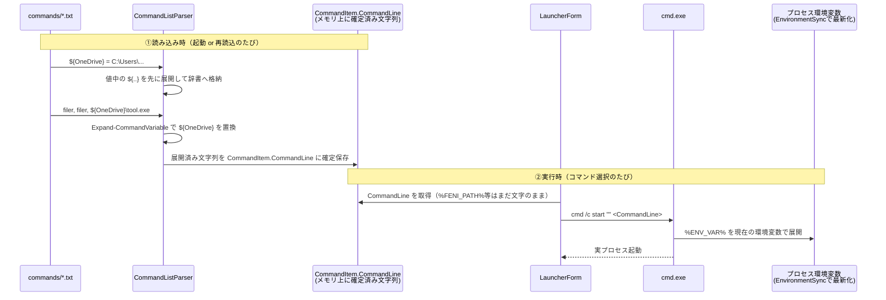
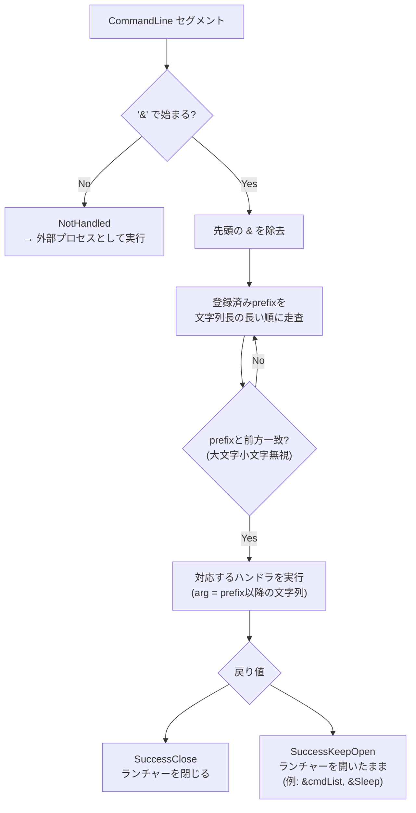
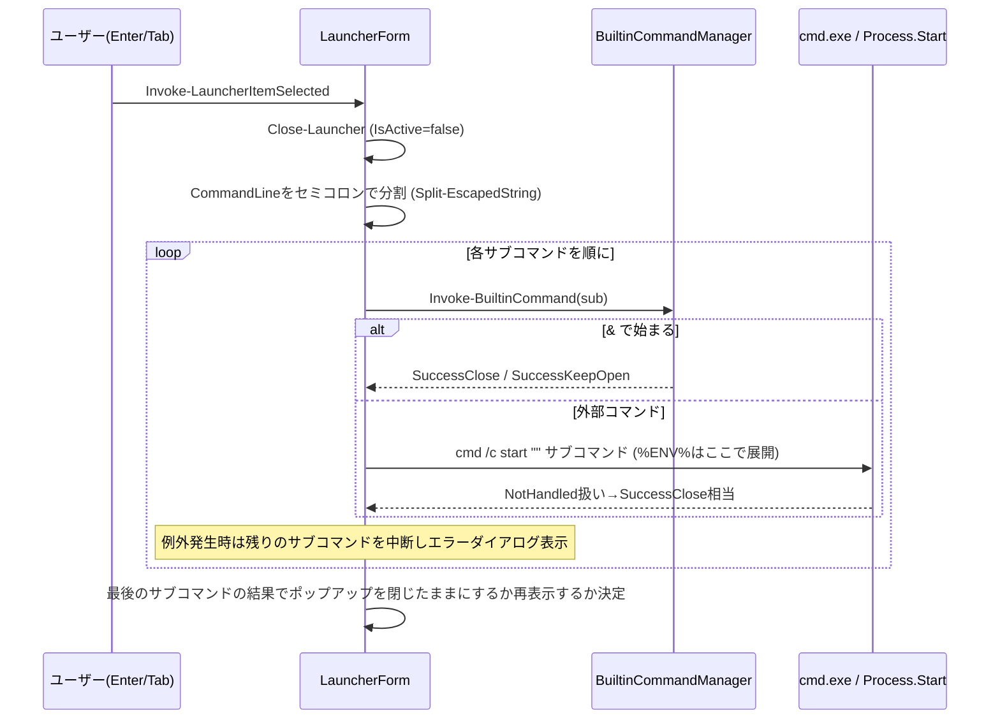
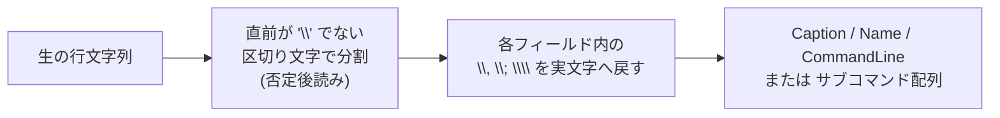
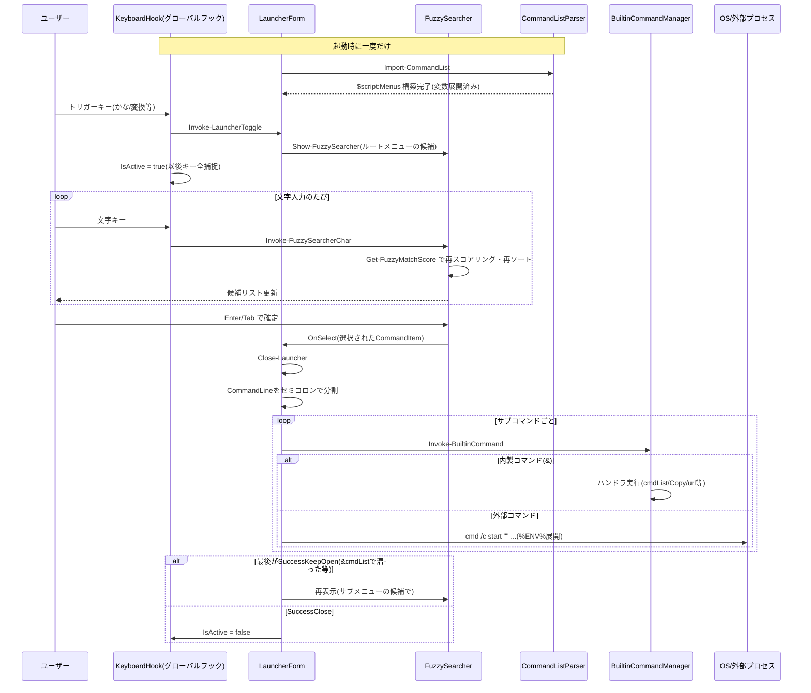

# FuzzyLauncher 設計資料 ― 検索エンジン／コマンド定義ファイル／変数解釈／独自構文

対象バージョン: PowerShell 5.1 + WinForms 実装（`FuzzyLauncher.ps1` 起点）

---

## 0. 全体構成



- **検索エンジン**（`UI/FuzzySearcher.psm1`）は完全にアプリ非依存の汎用コンポーネント。`(Name, Caption)` の一覧と入力文字列を受け取り、スコア順に並べ替えるだけ。
- **コマンド定義**（`Core/CommandListParser.ps1`）は `commands/*.txt` を読み、`$script:Menus` に格納する。
- **変数解釈**は「読み込み時（`${...}`）」と「実行時（`%ENV%`）」の2段階に分かれている。
- **独自構文**（`&builtin`, `;`連結, `\`エスケープ）は `Core/BuiltinCommandManager.ps1` と `UI/LauncherForm.ps1` の実行フェーズで解釈される。

---

## 1. 検索エンジン（あいまい検索）

実装: `UI/FuzzySearcher.psm1`

### 1.1 スコアリングアルゴリズム

`Get-FuzzyMatchScore(target, query)` は、クエリ文字を先頭から貪欲に target 内へ割り当てていく **左→右・貪欲・部分列マッチ**（Sublime/VSCode 系のあいまい検索と同系統）。



- 1つの target 文字は最大1回しか消費されない（マッチ済みは `*` に置換）。
- スコア定数は `settings.ini` の `[Scoring]` セクションで変更可能（既定値はいずれも 20 / 10 系）。
- 戻り値は `{ Score, Bingo }`。`Bingo` はマッチ箇所を `*` に置き換えた文字列（デバッグ表示用）。

| target | query | スコア | 内訳 |
|---|---|---|---|
| `notepad` | `no` | 80 | n: 先頭+略語(20+20), o: 連続(20+20) |
| `notepad` | `z` | -10 | 不一致1回 |
| `notepad` | `zz` | -30 | 不一致 -10、連続不一致 -10-10 |
| `my_command` | `mc` | 80 | `_` の直後の `c` が略語ボーナス |
| `MyCommand` | `mc` | 80 | 大文字 `C` が略語ボーナス |

### 1.2 インクリメンタル検索のシーケンス



- ソートはスコア降順、同点は元のインデックス順で **安定ソート**（PowerShell の `Sort-Object` が非安定なため明示的に実装）。
- `&toggleDebug` で `Score` / `Bingo` 列を表示できる。

---

## 2. コマンド定義ファイル（`commands/*.txt`）

実装: `Core/CommandListParser.ps1`（読込は `Core/CommandManager.ps1` の `Import-CommandList` から）

### 2.1 ファイル読み込みフロー



- 行単位のエラー（未定義変数参照など）は `try/catch` で個別に捕捉し、その行だけスキップして残りは継続読込。
- メニュー名の比較は大文字小文字を区別（`Ordinal`）、コマンド名(`Name`)の重複判定は区別しない（`OrdinalIgnoreCase`）。

### 2.2 データモデル



### 2.3 行フォーマット早見表

| 行の先頭 | 意味 | 例 |
|---|---|---|
| （なし・空行） | 無視 | |
| `#` | コメント | `# ここに説明` |
| `%` | メニュー（グループ）見出し | `%りそな` |
| `${` | 変数定義 | `${OneDrive} = C:\Users\...` |
| それ以外 | コマンド行（`表示名, コマンド名, 実行コマンド`） | `feni, feni, "%FENI_PATH%\bootstrap.bat"` |

### 2.4 サンプル（`default.txt` 抜粋）

```txt
${OneDrive} = C:\Users\dobashi\OneDrive - ...
${filer}    = "${OneDrive}\...\MDIE.exe"

!Add command,   addcommand, &addCommand
りそな,          risona,     &cmdList りそな

%りそな
出納帳確認,      osahou,     ${filer} "${OneDrive}\...\出納帳..."
戻る,            exit,       &cmdList
```

---

## 3. 変数解釈

FuzzyLauncher には性質の異なる **2種類の変数展開** があり、解決タイミングが違う点が最重要ポイント。

| 種類 | 構文 | 解決タイミング | 解決者 | 定義場所 |
|---|---|---|---|---|
| 自作変数 | `${name}` | **読み込み時**（起動時 / コマンド追加後の再読込時） | `CommandListParser.ps1` の `Expand-CommandVariable` | `commands/*.txt` 内 `${name} = value` |
| OS環境変数 | `%ENV_VAR%` | **実行時** | `cmd.exe`（FuzzyLauncher 自身は展開しない） | Windowsの環境変数（レジストリ） |

> `{query}` `{clipboard}` のような「実行のたびに変わる」プレースホルダは **存在しない**。クリップボードは `&Copy` で書き込む用途のみで、コマンド行内で読み出す構文は無い。

### 3.1 二段階解決のシーケンス



- `${name}` は **前方参照不可**（定義前に参照すると `未定義の変数: ${name}` で例外→その行だけスキップ）。同ファイル内はもちろん、アルファベット順で後に読まれる別ファイルからも前のファイルの変数を参照できる。
- `%ENV_VAR%` は `&` 始まりの内製コマンドには効かない（`cmd.exe` を経由しないため）。外部プロセス起動行のみ有効。
- `Utils/EnvironmentSync.ps1` が起動時に一度、レジストリから直接環境変数を読み直しプロセスに反映する（ログオンし直さなくても新しい `%VAR%` を使えるようにするための仕組み）。

---

## 4. 独自構文

実装: `Core/BuiltinCommandManager.ps1` + `Core/BuiltinCommands/*.ps1`（`&`構文）、`UI/LauncherForm.ps1`（`;`連結）、`Utils/StringHelper.ps1`（エスケープ）

### 4.1 記号の役割まとめ

| 記号 | 位置 | 役割 |
|---|---|---|
| `&` | `CommandLine` セグメントの先頭 | 内製コマンド呼び出し |
| `;` | `CommandLine` 内 | 複数コマンドを順番に実行（チェーン） |
| `,` | コマンド定義行 | `Caption, Name, CommandLine` のフィールド区切り |
| `\` | `,` `;` の直前 | 区切り文字のエスケープ（`\,` `\;`） |
| `%` | 行頭 | メニュー見出し（コマンド定義ファイル側の構文） |
| `%...%` | `CommandLine` 内 | OS環境変数（`cmd.exe` が展開） |
| `${...}` | どこでも | 自作変数の参照／定義 |

### 4.2 `&` 内製コマンドのディスパッチ（最長一致）



長い prefix を先に試すのは、`activeTitle ` と `waitActiveTitle ` のような包含関係のある prefix を正しく区別するため。

### 4.3 主な内製コマンド一覧

| コマンド | 効果 | 戻り値 |
|---|---|---|
| `&cmdList [menu]` | メニュー切替（引数なしはルートへ）＋入力欄リセット | KeepOpen |
| `&Copy <text>` | クリップボードへコピー | Close |
| `&url <url>` | 既定ブラウザで開く | Close |
| `&activeTitle/&activeExe/&activeClass <値>` | 該当ウィンドウをアクティブ化 | Close |
| `&waitActiveTitle/&waitActiveExe/&waitActiveClass <値>` | 該当ウィンドウが前面に来るまでポーリング待機（タイムアウトで例外） | KeepOpen(通常) |
| `&SendKeys <keys>` | ランチャーを閉じてから `SendKeys.SendWait` | Close |
| `&Sleep <ms>` | UIポンピングしながら待機 | KeepOpen |
| `&addCommand` | コマンド追加ダイアログを開く | Close |
| `&editThisCommand` | `default.txt` をメモ帳で開く | Close |
| `&reloadThisApp` / `&exitThisApp` | 再起動 / 終了 | Close |
| `&toggleDebug` | 検索エンジンの Score/Bingo 列表示切替 | Close |

### 4.4 `;` チェーン実行のシーケンス



例: `notepad.exe; &waitActiveTitle メモ帳; &Dialog メモ帳が起動しました！`
→ メモ帳起動 → ウィンドウ出現を待機 → ダイアログ表示、の3段階を1行で記述できる。

### 4.5 エスケープ規則

`Utils/StringHelper.ps1` の `Split-EscapedString` が `,`（コマンド定義の3分割）と `;`（実行時チェーン分割）の両方で共用される。

- `\,` → 区切りとして扱わずリテラルの `,`
- `\;` → 区切りとして扱わずリテラルの `;`
- `\\,` → 直前1文字だけ見るため分割されない（`\\,`→`\,`のリテラルとして残る、連続エスケープの直前1文字のみを見る仕様）



---

## 5. エンドツーエンド全体シーケンス



---

## 参考ソース

- `UI/FuzzySearcher.psm1`（検索エンジン本体）
- `Core/CommandListParser.ps1`（コマンド定義ファイルのパース／変数展開）
- `Core/CommandManager.ps1`（メニュー状態管理）
- `Core/BuiltinCommandManager.ps1` + `Core/BuiltinCommands/*.ps1`（`&`独自構文）
- `UI/LauncherForm.ps1`（`;`チェーン実行、外部プロセス起動）
- `Utils/StringHelper.ps1`（エスケープ付き分割）
- `Utils/EnvironmentSync.ps1`（`%ENV%`のための環境変数同期）
